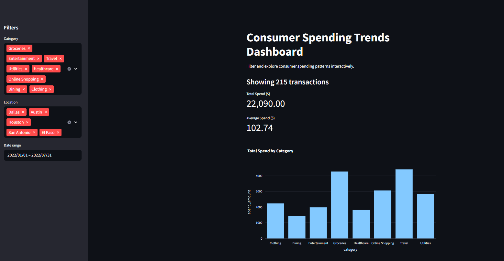
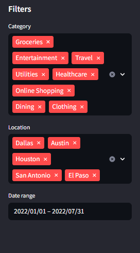
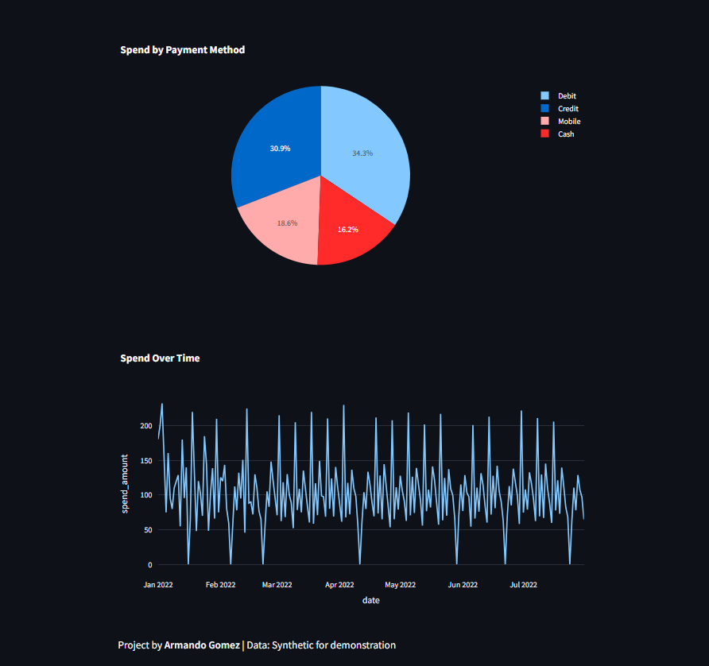

# Consumer Spending Trends Dashboard

## 📌 Project Summary
This project analyzes realistic, large-scale consumer spending data (synthetic, 300+ rows) to uncover trends by category, location, age group, and payment method. Insights are visualized in an interactive Streamlit dashboard.

## 📊 Key Features
- **Data Cleaning:** Handle missing, zero, and outlier values in spending.
- **Exploratory Data Analysis (EDA):** Aggregate spending by time, category, city, and demographic segments.
- **Visualization:** Bar, line, and pie charts using Plotly for interactive insights.
- **Dashboard:** Filter and explore trends with Streamlit.
- **Professional Workflow:** Clean code, Jupyter notebooks, Git versioning, and well-documented commits.

## 🗂️ Dataset
- **File:** `data/raw/consumer_spending.csv`
- **Rows:** 300+ synthetic transactions
- **Columns:**  
  - `date`: Transaction date  
  - `category`: Spending category (Groceries, Entertainment, Travel, etc.)  
  - `spend_amount`: Amount spent  
  - `location`: City  
  - `age_group`: Age group (18-24, 25-34, etc.)  
  - `payment_method`: Cash, Credit, Debit, Mobile

## 🧰 Tech Stack
- **Languages:** Python, SQL
- **Libraries:** Pandas, NumPy, Matplotlib, Plotly, Streamlit
- **Tools:** Jupyter Notebook, Git, GitHub

## 🚀 How to Run
1. Clone the repo
2. `cd Consumer-Spending-Dashboard`
3. `pip install -r requirements.txt`
4. Place the dataset in `/data/raw/`
5. Run the notebook for data cleaning:  
   - Open `notebooks/01_data_cleaning.ipynb` in VS Code  
   - Run all cells  
6. Launch the dashboard:  
   ```
   streamlit run dashboard/app.py
   ```

## 📈 Sample Visualizations
## 📸 Dashboard Screenshots

Below are examples of the interactive dashboard and data visualizations built with Streamlit and Plotly.

### Dashboard Overview



### Filter Categories



### Data Graphs Example




## 📄 Reports
- **insights_report.pdf:** Visual summary and business recommendations (coming soon)
- **executive_summary.md:** Short non-technical summary

## 💡 Credits
Built by Armando Gomez, 2025.  
Data: Synthetic (generated for demonstration).
