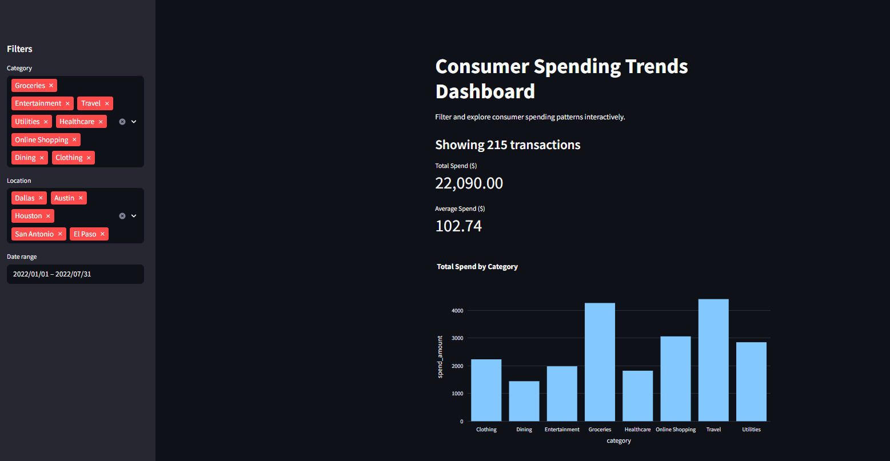
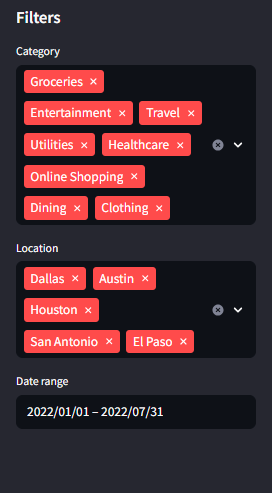
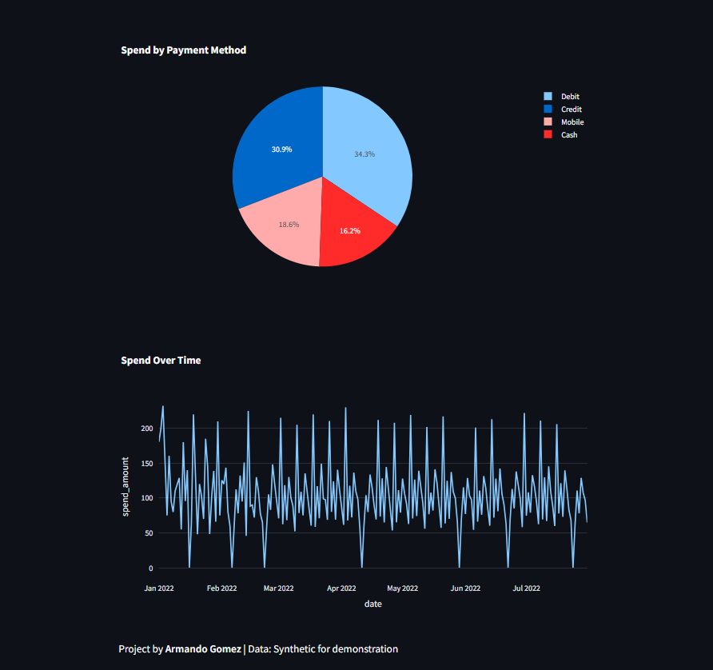

# Consumer Spending Trends Dashboard

An end-to-end consumer spending analysis: a raw transaction dataset is cleaned in a
Jupyter notebook, explored through EDA, and served in an interactive Streamlit dashboard
where trends can be filtered by category, location, and date range.

> **Note:** The dataset is synthetic, generated for demonstration purposes. It is
> realistic in shape but does not represent real consumer behavior.

## Data Pipeline

```
data/raw/consumer_spending.csv        (216 raw transactions)
        │
        ▼   notebooks/01_data_cleaning.ipynb
        │   drop missing spend, coerce dates, coerce spend to numeric, drop invalid rows
        ▼
data/processed/cleaned_spending.csv   (215 cleaned transactions)
        │
        ├──►  notebooks/02_eda.ipynb   exploratory analysis + charts
        │
        └──►  dashboard/app.py         interactive Streamlit dashboard
```

## Dataset

- **Raw:** `data/raw/consumer_spending.csv` (216 rows)
- **Cleaned:** `data/processed/cleaned_spending.csv` (215 rows)
- **Columns:**
  - `date` — transaction date
  - `category` — spending category (Groceries, Entertainment, Travel, Utilities, etc.)
  - `spend_amount` — amount spent (USD)
  - `location` — city (Dallas, Houston, Austin, San Antonio, and others)
  - `age_group` — 18-24, 25-34, 35-44, 45-54, 55-64
  - `payment_method` — Cash, Credit, Debit, Mobile

## How to Run

```bash
# 1. Clone and enter the project
git clone https://github.com/ArmandoSNHU/Consumer-Spending-Dashboard.git
cd Consumer-Spending-Dashboard

# 2. (optional) create and activate a virtual environment
python -m venv .venv
# Windows: .venv\Scripts\activate   |   macOS/Linux: source .venv/bin/activate

# 3. Install dependencies
pip install -r requirements.txt

# 4. (optional) regenerate the cleaned dataset from raw
#    open notebooks/01_data_cleaning.ipynb and run all cells

# 5. Launch the dashboard
streamlit run dashboard/app.py
```

The dashboard reads `data/processed/cleaned_spending.csv` (already included in the repo),
so it runs immediately after installing the requirements.

## Dashboard Features

- Sidebar filters for **category**, **location**, and **date range**
- Live **total spend** and **average spend** metrics for the current selection
- **Bar chart** — total spend by category
- **Pie chart** — spend by payment method
- **Line chart** — spend over time

## Key Insights

Drawn from `reports/executive_summary.md`:

- **Top categories:** Groceries and Travel consistently lead total and average spend.
- **Regional trends:** Spending concentrates in urban centers (notably Dallas and
  Houston), with the most variation in discretionary categories.
- **Demographics:** The 25-34 and 35-44 age groups spend more on Online Shopping and
  Travel; older groups allocate more to Healthcare and Utilities.
- **Payment methods:** Credit and Debit dominate volume, while Mobile payments are
  rising among younger consumers.
- **Seasonality:** Spend spikes at the start of each month and during spring, reflecting
  modeled salary/seasonal cycles in the synthetic data.

## Dashboard Screenshots

### Dashboard Overview


### Filter Categories


### Data Graphs Example


## Reports

- `reports/executive_summary.md` — short, non-technical summary of findings.
- `reports/insights_reports.pdf` — visual summary and business recommendations.

## Tech Stack

- **Language:** Python
- **Analysis:** Pandas, NumPy
- **Visualization:** Plotly, Matplotlib
- **Dashboard:** Streamlit
- **Tools:** Jupyter Notebook, Git

## Project Structure

```
Consumer-Spending-Dashboard/
├── dashboard/
│   └── app.py                     # Streamlit dashboard
├── data/
│   ├── raw/consumer_spending.csv       # raw transactions
│   └── processed/cleaned_spending.csv  # cleaned dataset used by the app
├── notebooks/
│   ├── 01_data_cleaning.ipynb     # raw → cleaned pipeline
│   └── 02_eda.ipynb               # exploratory data analysis
├── reports/
│   ├── executive_summary.md
│   └── insights_reports.pdf
├── screenshots/
├── requirements.txt
└── README.md
```

## Author

Armando Gomez, 2025.
